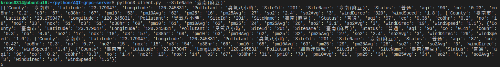
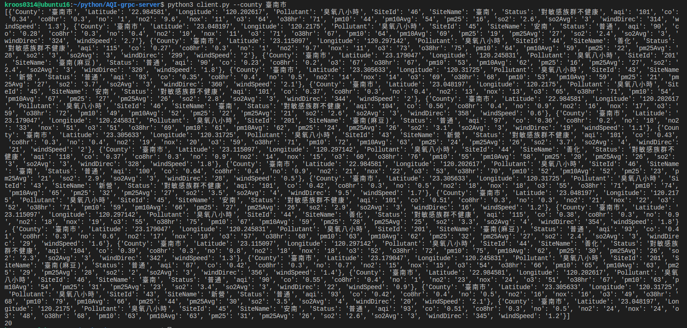
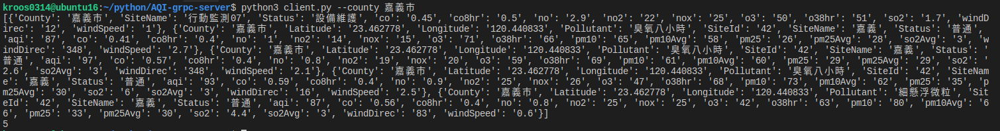
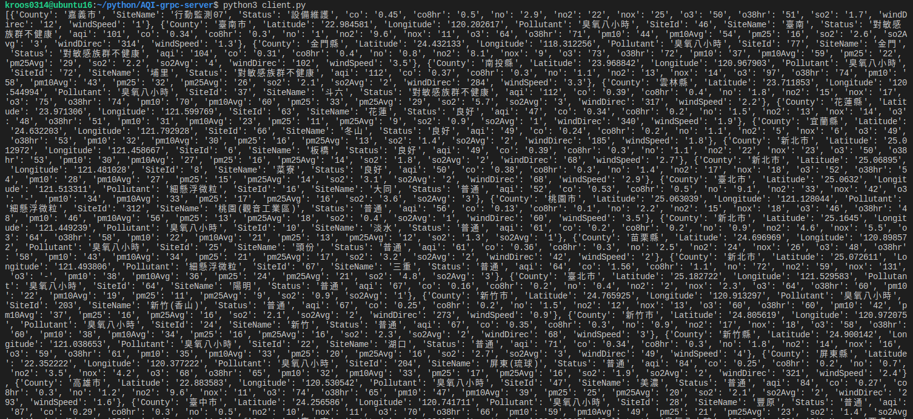

# What is AQI-GRPC-Server
AQI-GRPC-Server is a grpc server that can be used to access databases via grpc protocol by users.
## Run app for Local

1. Clone AQi-grpc-server repository
    ```shell
    git clone https://github.com/ekko771/AQI-grpc-server.git
    ```
2. setting your config file to etc
    ```shell
    cd clone_repo
    vim ./config/config.yaml
    ```
3. run app
    ```shell
    python3 server.py --config your_config
    ```

## Build docker image

1. Install docker

2. Execute build command

    ```shell
    docker build -t ekko771/aqi-grpc-server:v1 .
    ```
## Local Development with Docker Compose

1. deploy containers

    ```shell
    docker-compose up
    ```
2. delete containers
    ```shell
    docker-compose down
    ```

## Example
```shell
kroos0314@ubuntu16:~/python/AQI-grpc-server$ python3 client.py  --S
usage: client.py [-h] [--County COUNTY] [--SiteName SITENAME]
client.py: error: argument --SiteName: expected one argument
```




## References

- [Open Data](https://opendata.epa.gov.tw/ws/Data/AQI/?$format=json)
- [gRPC vs. REST: Performance Simplified](https://medium.com/@bimeshde/grpc-vs-rest-performance-simplified-fd35d01bbd4)
- [Getting started with gRPC](https://grpc.io/docs/quickstart/)
- [Getting started with Docker Compose](https://docs.docker.com/compose/gettingstarted/)
- [Welcome to gRPC Python’s documentation!](https://grpc.github.io/grpc/python/)
- [Getting started with InfluxDB OSS](https://docs.influxdata.com/influxdb/v1.7/introduction/getting-started/)
- [InfluxDB API Documentation](https://influxdb-python.readthedocs.io/en/latest/api-documentation.html)

